# Bookmarker

## Project Information
**Bookmarker** is an app that lets you log your reading sessions, or "Bookmarks", and track your progress on each book. The purpose of this app is to promote reading by letting users see their reading progress and discover new books. There are 6 pages in total.
1. **Login page**: users can either sign up or sign in with email and password, or they can go to the home page without authentication.
2. **Home page**: shows a search bar and a list of most popular books. There is a sign in / sign up button at the bottom of the page if the user is not logged in.
3. **Search page**: users will be able to search books by Title, Author, Publisher, Genre, or ISBN. The search result can be sorted and filtered by published date, genre, number of pages, and rating. 
4. **Book information page**: metadata about the book will be displayed. 5 latest user star ratings will also be present. When you click on a username, or a profile picture, you will go to that user’s profile. Users can search a genre by clicking the genre blob. Finally, users can log their reading sessions by clicking the Bookmark button.
5. **Bookmark page**: For each session, user will log the date, start time, end time, start page, and end page. When the user clicks on "Save Bookmark" button, there will be a message to tell if the request succeeds or fails. Users can also delete and edit bookmarks as well.
6. **Profile page**: every user's profile page is publicly available. This page includes several things such as:
   - The user’s **“My Top Ten”** List, which is a list that the users can add up to 10 favourite books. This makes each book in the list more important to the user instead of allowing them to add an infinite number of books into the list. For that, users can use **“My Shelf”**, which is a list of all books that users have logged Bookmarks or given ratings before.
     - If the user clicks "Add to My Top Ten" when the Top Ten list is already full, the first book that gets added into the list will pop out first (First In First Out).
     - Users can delete books from both lists as they wish by clicking the edit button. When the user clicks the remove button, there will be a popup to confirm removing.
   - Line graph of the number of hours the user spent reading books in the current month is shown on the page. Users can also view last month’s graph by selecting at the dropdown.


## Members
1. Vinita Jungwiwattanaporn ([@vinitian](https://github.com/vinitian))
2. Sasiras Yodruangsa ([@Sasirasys](https://github.com/Sasirasys))


## Getting started

1. Install dependencies

   ```bash
   npm install
   ```

2. Start the app

   ```bash
    npx expo start
   ```

3. Open [localhost:8081](http://localhost:8081) in your browser. You can also open the app in:
   - [Android emulator](https://docs.expo.dev/workflow/android-studio-emulator/) by pressing `a`
   - [iOS simulator](https://docs.expo.dev/workflow/ios-simulator/) by pressing `i` (available only on Mac)
   - [Expo Go](https://expo.dev/go) on your devices


## Screenshots
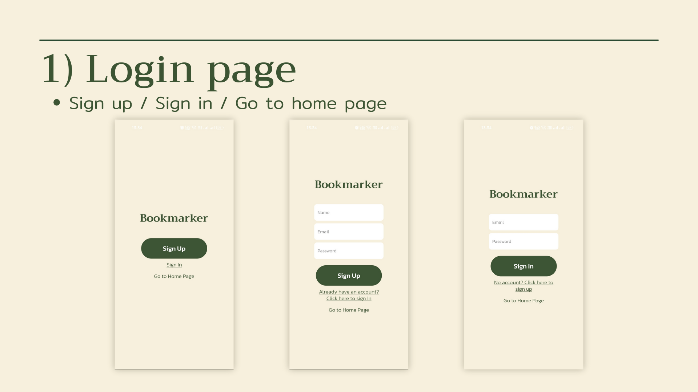
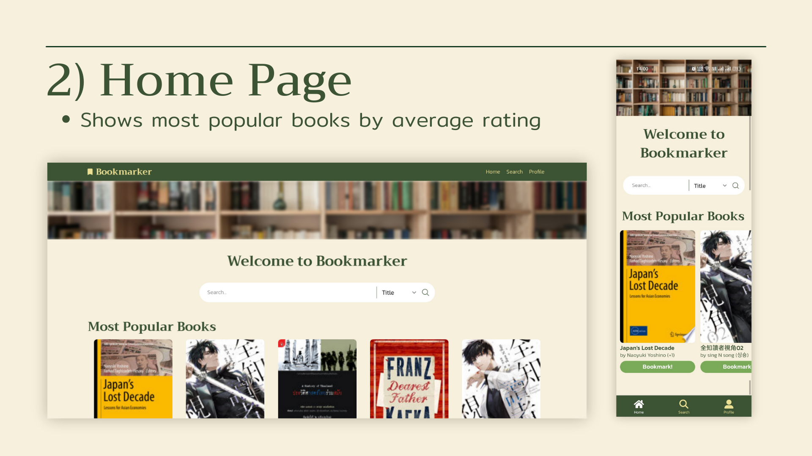
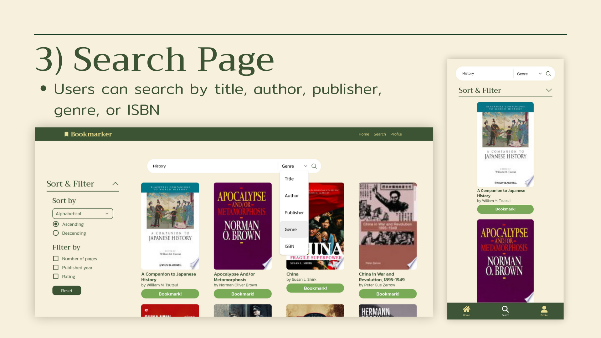
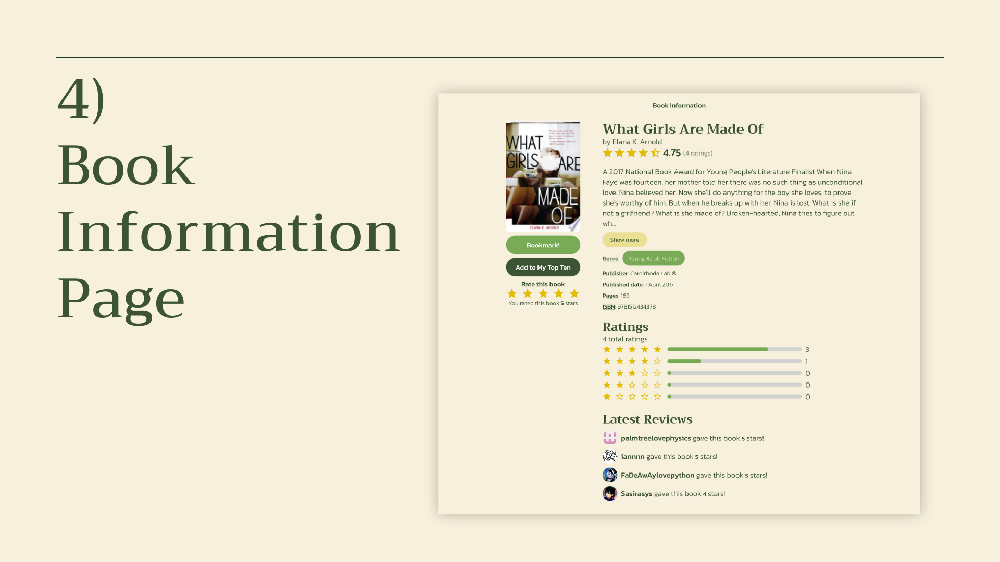
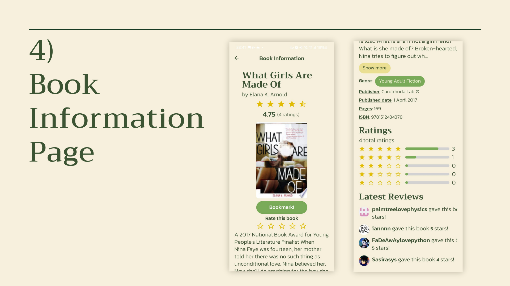
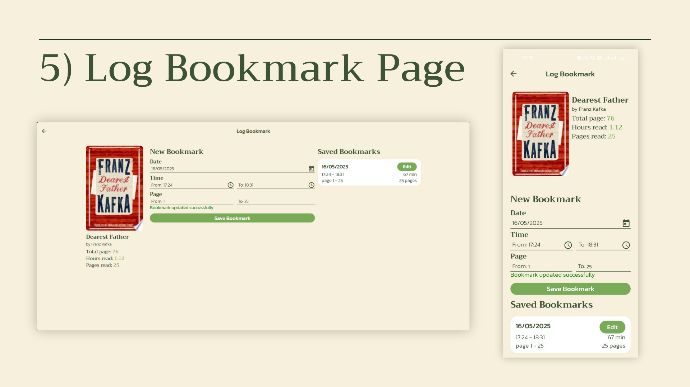
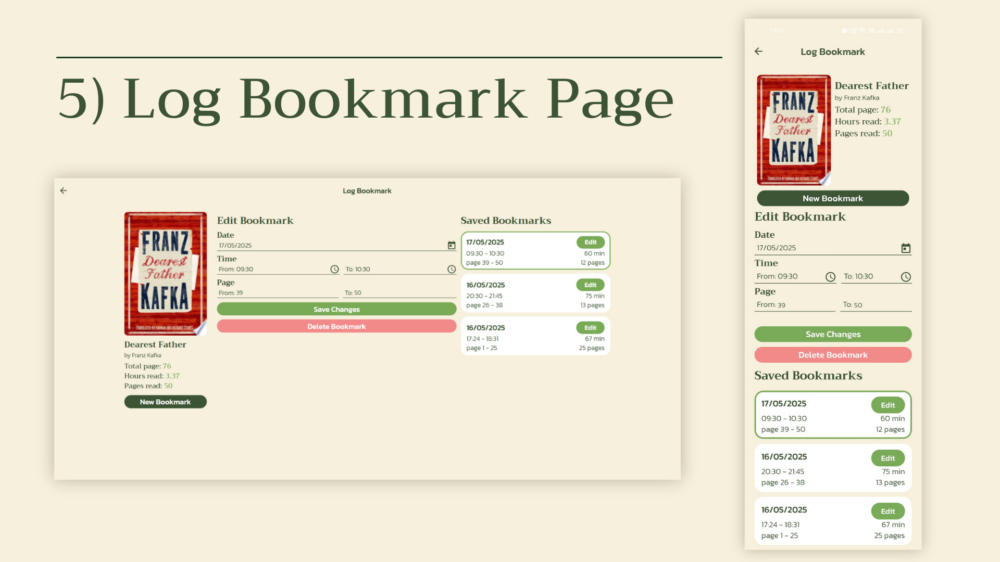
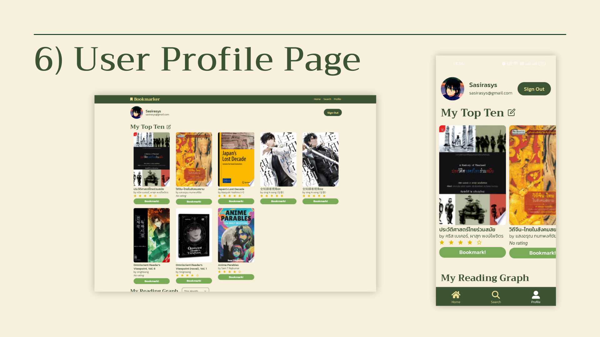
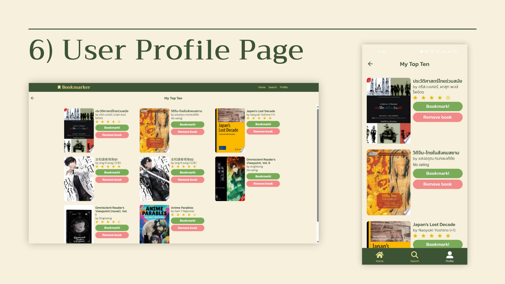
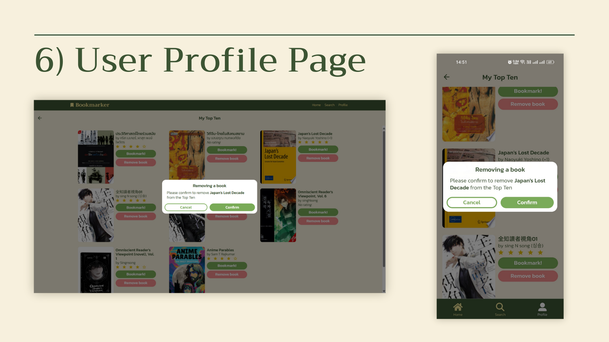
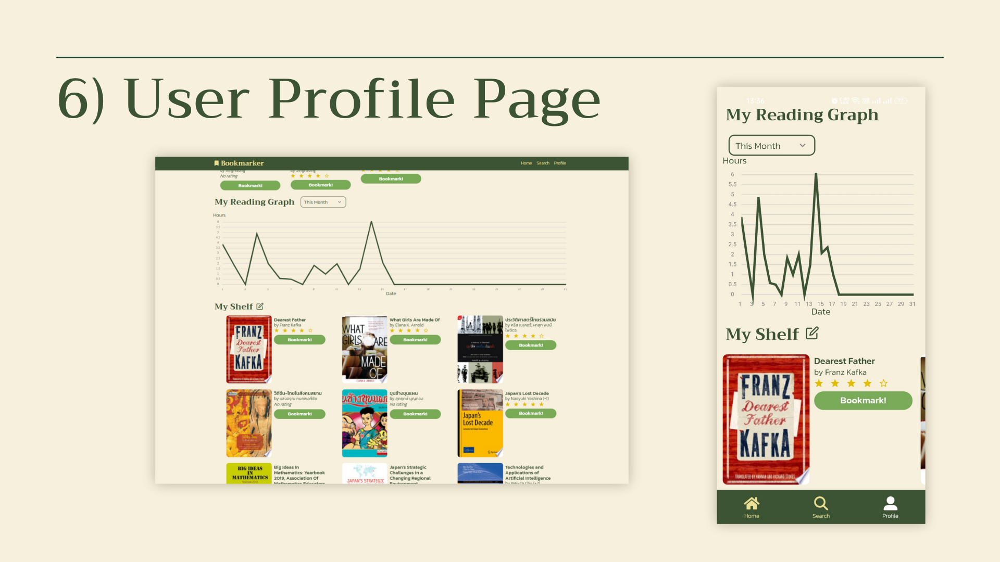
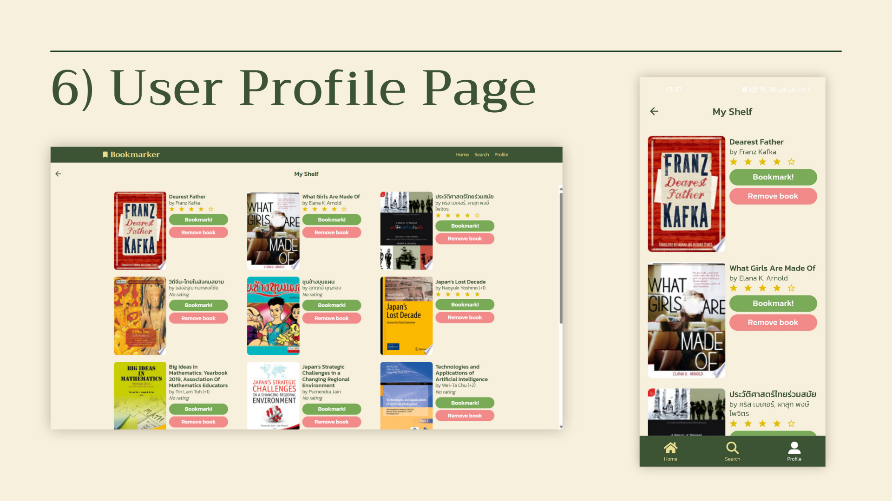
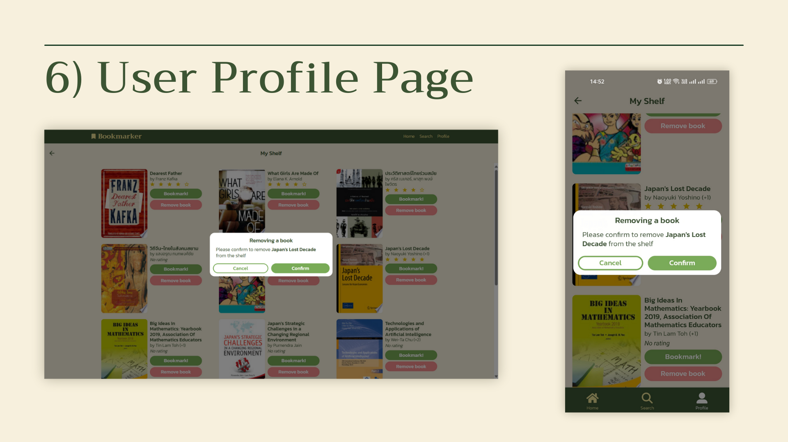
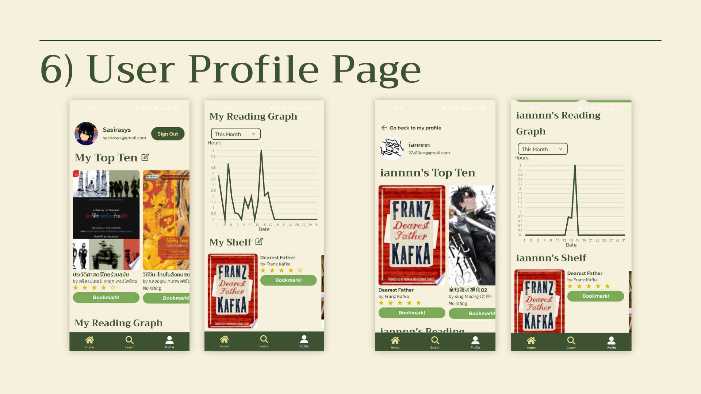